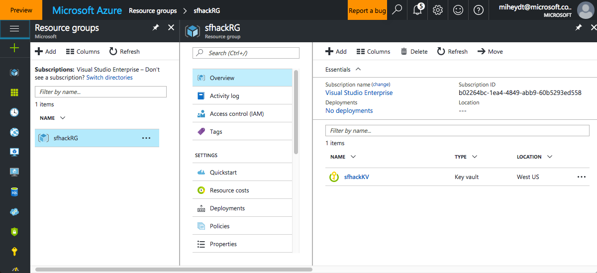
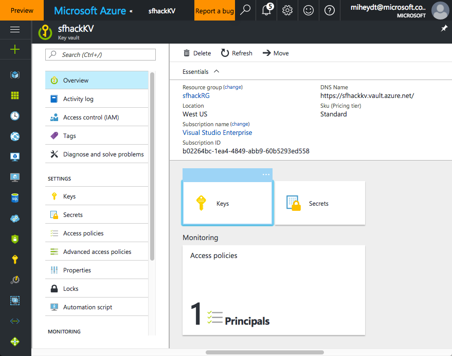
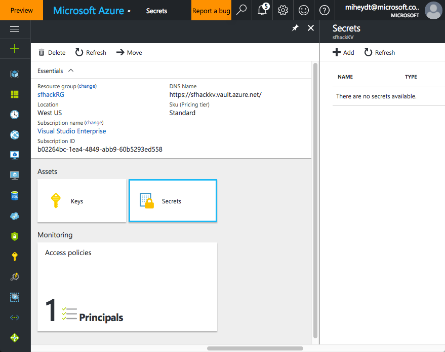

This script creates a self signed certificate.  To run it, you should change the value of two variables in the file:
* *$certDNSName*
* *$certFileName*
```
# DNS name for the certificate
# If you are using this for service fabric, this must match the name of the service fabric cluster
# that your are attempting to authenticate with
$certDNSName = "miketest1"

# This will be the name of the certificate file
$certFileName = $certDNSName
#$certFileName = "readonly"
#$certFileName = "admin"
```

When the script completes running, you should have a cert in the *certs* subdirectory, and see output similar to the following.  Details will differ for you specific certificate:
```
PS C:\Program Files (x86)\Microsoft Visual Studio 14.0\Common7\IDE> D:\SFTF\SFTF.PS\01 - Create-SelfSignedCert.ps1


    Directory: D:\SFTF\SFTF.PS\certs


Mode                LastWriteTime         Length Name                          
----                -------------         ------ ----                          
-a----          2/22/17  11:27 AM           2630 miketest1.pfx                 

PSPath                   : Microsoft.PowerShell.Security\Certificate::LocalMach
                           ine\My\177ECE544D52DC51FE6B326804051282184D5C28
PSParentPath             : Microsoft.PowerShell.Security\Certificate::LocalMach
                           ine\My
PSChildName              : 177ECE544D52DC51FE6B326804051282184D5C28
PSIsContainer            : False
Archived                 : False
Extensions               : {System.Security.Cryptography.Oid, 
                           System.Security.Cryptography.Oid, 
                           System.Security.Cryptography.Oid, 
                           System.Security.Cryptography.Oid}
FriendlyName             : 
IssuerName               : System.Security.Cryptography.X509Certificates.X500Di
                           stinguishedName
NotAfter                 : 2/22/18 11:37:11 AM
NotBefore                : 2/22/17 11:17:11 AM
HasPrivateKey            : True
PrivateKey               : 
PublicKey                : System.Security.Cryptography.X509Certificates.Public
                           Key
RawData                  : {48, 130, 3, 24...}
SerialNumber             : 3A28DEDF145C1A8E48C1AC74748E87A1
SubjectName              : System.Security.Cryptography.X509Certificates.X500Di
                           stinguishedName
SignatureAlgorithm       : System.Security.Cryptography.Oid
Thumbprint               : 177ECE544D52DC51FE6B326804051282184D5C28
Version                  : 3
Handle                   : 1457134800144
Issuer                   : CN=miketest1
Subject                  : CN=miketest1
EnhancedKeyUsageList     : {Client Authentication (1.3.6.1.5.5.7.3.2), Server 
                           Authentication (1.3.6.1.5.5.7.3.1)}
DnsNameList              : {miketest1}
SendAsTrustedIssuer      : False
EnrollmentPolicyEndPoint : Microsoft.CertificateServices.Commands.EnrollmentEnd
                           PointProperty
EnrollmentServerEndPoint : Microsoft.CertificateServices.Commands.EnrollmentEnd
                           PointProperty
PolicyId                 : 

Created a certificate at D:\SFTF\SFTF.PS/certs/miketest1.pfx
Thumbprint: [Subject]
  CN=miketest1

[Issuer]
  CN=miketest1

[Serial Number]
  3A28DEDF145C1A8E48C1AC74748E87A1

[Not Before]
  2/22/17 11:17:11 AM

[Not After]
  2/22/18 11:37:11 AM

[Thumbprint]
  177ECE544D52DC51FE6B326804051282184D5C28
.Thumbprint
```
You can verify by looking at the resources in the port.  You should see a resource group created.


Clicking on the resource group you will see that it has one resource group with one resource - the key vault.



Clicking on the key valut link takes you to the key vault.



There are no secrets in this new key vault.  We will add one in the next script.


