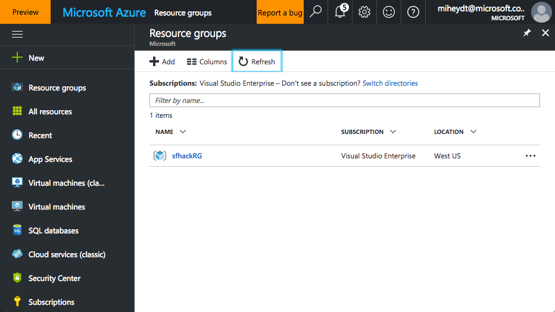
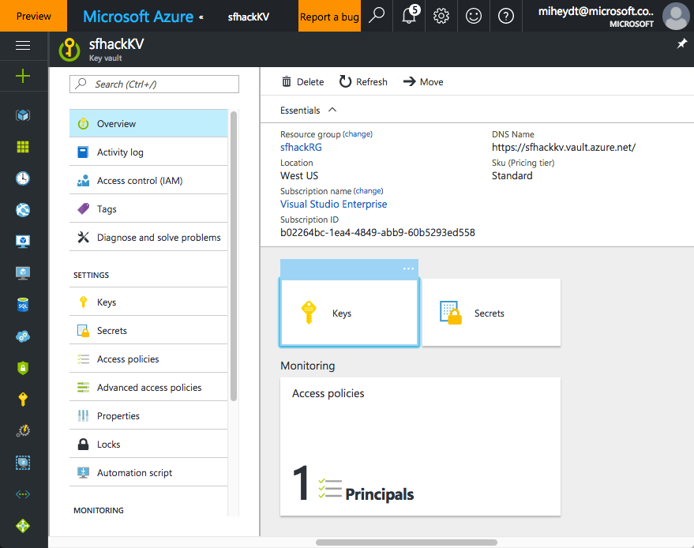
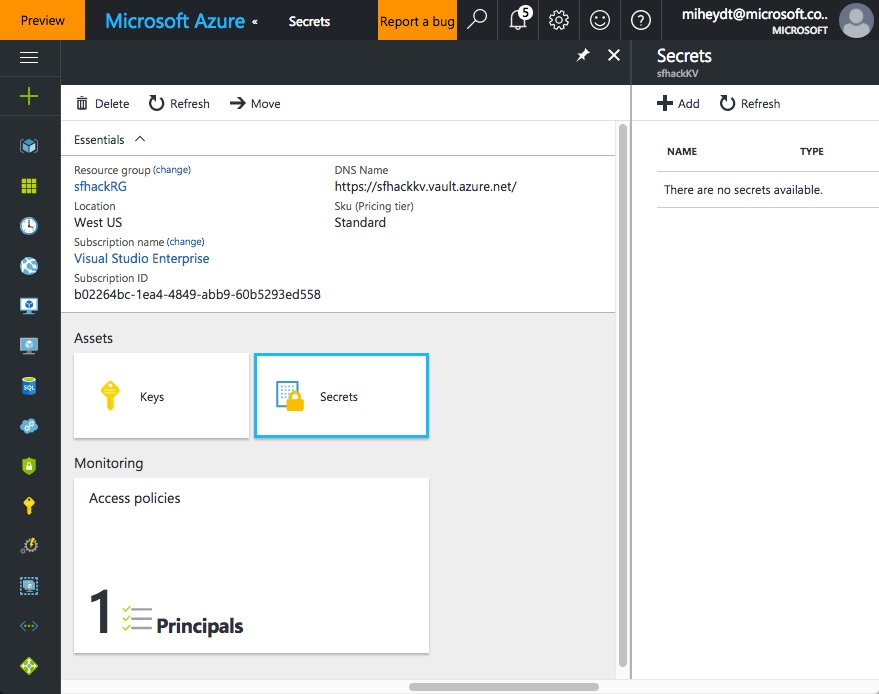

This script creates a new resource group and key vault. You will need to change the following variables to suit your needs.

_Note: The script assumes the resource group and key vault do not already exist_
```
# Resource group for the Key-Vault service. 
$resourceGroup = "sfhackRG" 

# Name of the Key Vault service
$keyVaultName = "sfhackKV" 

# Set the Subscription ID; needed if you have more than one - and you need to change to yours
$subscriptionId = "b02264bc-1ea4-4849-abb9-60b5293ed558" 

# Specify the region to locate the keyvault
$location = "West US"

```
Make sure to change the subscription id.  This one will not work for you.  The other variables may need to be changed, as if those resources exist in the subscription then things may fail for you.  So, just change them to something unique for your scenario.

When running, you will be asked to authenticate to azure, and then everything will be created.  Output should be similar to the following:
```
Environment           : AzureCloud
Account               : miheydt@microsoft.com
TenantId              : 72f988bf-86f1-41af-91ab-2d7cd011db47
SubscriptionId        : b02264bc-1ea4-4849-abb9-60b5293ed558
SubscriptionName      : Visual Studio Enterprise
CurrentStorageAccount : 


Account      : miheydt@microsoft.com
Environment  : AzureCloud
Subscription : b02264bc-1ea4-4849-abb9-60b5293ed558
Tenant       : 72f988bf-86f1-41af-91ab-2d7cd011db47


ResourceGroupName : sfhackRG
Location          : westus
ProvisioningState : Succeeded
Tags              : 
TagsTable         : 
ResourceId        : /subscriptions/b02264bc-1ea4-4849-abb9-60b5293ed558/resourc
                    eGroups/sfhackRG


VaultUri                     : https://sfhackKV.vault.azure.net
TenantId                     : 72f988bf-86f1-41af-91ab-2d7cd011db47
TenantName                   : 72f988bf-86f1-41af-91ab-2d7cd011db47
Sku                          : Standard
EnabledForDeployment         : True
EnabledForTemplateDeployment : False
EnabledForDiskEncryption     : False
AccessPolicies               : {72f988bf-86f1-41af-91ab-2d7cd011db47}
AccessPoliciesText           : 
                               Tenant ID                   : 
                               72f988bf-86f1-41af-91ab-2d7cd011db47
                               Object ID                   : 
                               e7ecd17b-6b27-4613-be40-1dda8975c132
                               Application ID              : 
                               Display Name                : Michael Heydt 
                               (miheydt@microsoft.com)
                               Permissions to Keys         : get, create, 
                               delete, list, update, import, backup, restore
                               Permissions to Secrets      : all
                               Permissions to Certificates : all
                               
                               
OriginalVault                : Microsoft.Azure.Management.KeyVault.Models.Vault
ResourceId                   : /subscriptions/b02264bc-1ea4-4849-abb9-60b5293ed
                               558/resourceGroups/sfhackRG/providers/Microsoft.
                               KeyVault/vaults/sfhackKV
VaultName                    : sfhackKV
ResourceGroupName            : sfhackRG
Location                     : West US
Tags                         : {}
TagsTable                    : 
```
You can verify by looking at the resources in the portal.  You should see a resource group created.



Clicking on the resource group you will see that it has one resource group with one resource - the key vault.


Clicking on the key valut link takes you to the key vault.



There are no secrets in this new key vault.  We will add one in the next script.

