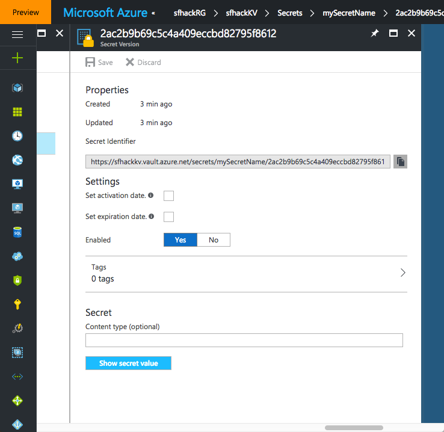

### Script: *03 - Add-KeyToKeyVault*
This script adds a certificate to your key vault.  There are three variables for you to potentially modify.
```
# The certificate that you want to add
# Note that if you are going to use this as authentication to a Service Fabric cluster,
# the DNS in the certificate must match the name of that cluster's FQDN
$certFileFullPath = "$PSScriptRoot/certs/mysfcluster1.pfx"

# Must specify a password for the certificate, same as when it was created
$password = "TheCertsPassword!1234"

# Need to create a secure password object
$securePassword = ConvertTo-SecureString -String $password -AsPlainText -Force

# Specify the name of the "secret" we are putting in Key Vault
$keyVaultSecretName = "mySecretName"

# Set the Subscription ID; needed if you have more than one - and you need to change to yours
$subscriptionId = "b02264bc-1ea4-4849-abb9-60b5293ed558" 
```

Output from the script will be similar to the following:
```
Environment           : AzureCloud
Account               : miheydt@microsoft.com
TenantId              : 72f988bf-86f1-41af-91ab-2d7cd011db47
SubscriptionId        : b02264bc-1ea4-4849-abb9-60b5293ed558
SubscriptionName      : Visual Studio Enterprise
CurrentStorageAccount : 

[VERBOSE] Performing the operation "Set secret" on target "mySecretName".
Resource Id:  /subscriptions/b02264bc-1ea4-4849-abb9-60b5293ed558/resourceGroups/sfhackRG/providers/Microsoft.KeyVault/vaults/sfhackKV
Secret URL :  https://sfhackkv.vault.azure.net:443/secrets/mySecretName/2ac2b9b69c5c4a409eccbd82795f8612
Thumbprint :  05F62F16CB93C4BD73609FAB17DE92EF00798CB1
```

These three value will be important in following exercises, so jot them down.

You can verify that the secret is added to the key vault in the portal.



Notice that the secret identifier matches the value of Secret URL in the output from the script.