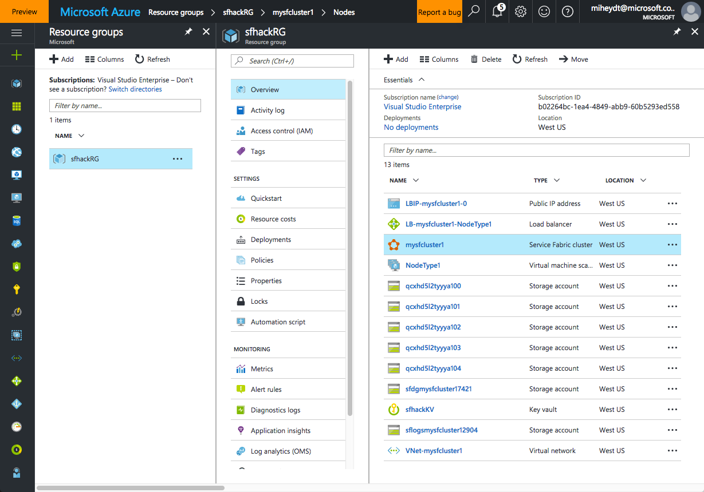

This script will provision a new, secure, service fabric cluster.  The primary work is done by the template in the *templates/cluster1_template.json* file.

The script starts by declaring several variables which you should set based upon your needs.  These are similar to the previous examples.
```
# The name of your Service Fabric cluster
$clusterName = "mysfcluster1"

# Which region of azure?
$location = "westus"

# The resource group where you want to place the cluster
$resourceGroupName = "sfhackRG"

# Set the Subscription ID; needed if you have more than one - and you need to change to yours
$subscriptionId = "b02264bc-1ea4-4849-abb9-60b5293ed558" 
```
The next variables establish where the template will look for you certificate to secure the cluster.  You were provided these as output of *03 - Add-KeyToKeyVault.ps1*.
```
# Replace with your key vaults resource id
$keyVaultResourceId = "/subscriptions/b02264bc-1ea4-4849-abb9-60b5293ed558/resourceGroups/sfhackRG/providers/Microsoft.KeyVault/vaults/sfhackKV"

# Replace with your key vault secret's id, which was obtained as output of adding the secret to key vault
$keyVaultSecretId = "https://sfhackkv.vault.azure.net:443/secrets/mySecretName/2ac2b9b69c5c4a409eccbd82795f8612"
```
You will also need to specify the thumbprint of the certificate that the previous two variables point to.  Change the following to the appropriate thumbprint.
```
# Replace with the thumbprint of your certificate.  This is for mysfcluster1.pfx
$certificateThumbprint = "812508463AE35AF784956315D3414DF1854CF8A6"

# mysfcluster2.pfx
# $certificateThumbprint = "015B7EA8023C0DEB2FE21280AE6F6425D0B557DC"
# mysfcluster3.pfx
# $certificateThumbprint = "3789E0A881409BC5283C326BE980F23D84FE9104"
# mysfcluster4.pfx
# $certificateThumbprint = "C6C89C4D8F01CA174233734568828E84BAF56499"
# mysfcluster5.pfx
# $certificateThumbprint = "279B5F1101838B70825B0885FEC503064159C862"
# mysfcluster6.pfx
# $certificateThumbprint = "5BF3305C59F5BB830A92C4D7F5BDC97C70A845B2"
```
The template and parameters file are in the *templtates* folder.
```
# Paths of the template and parameter files
$templateFilePath = "$PSScriptRoot/templates/cluster1_template.json"
$parametersFilePath = "$PSScriptRoot/templates/cluster1_parameters.json"
```
The script then reads the parameters file and overwrites several other parameters, then executes the template in the context of your azure account.

If successful you should see output similar to the following:
```
Environment           : AzureCloud
Account               : miheydt@microsoft.com
TenantId              : 72f988bf-86f1-41af-91ab-2d7cd011db47
SubscriptionId        : b02264bc-1ea4-4849-abb9-60b5293ed558
SubscriptionName      : Visual Studio Enterprise
CurrentStorageAccount : 


Account      : miheydt@microsoft.com
Environment  : AzureCloud
Subscription : b02264bc-1ea4-4849-abb9-60b5293ed558
Tenant       : 72f988bf-86f1-41af-91ab-2d7cd011db47


DeploymentName          : cluster1_template
CorrelationId           : c8786eac-47bc-4b60-87b5-d9156a5fb7db
ResourceGroupName       : sfhackRG
ProvisioningState       : Succeeded
Timestamp               : 2/22/17 8:44:05 PM
Mode                    : Incremental
TemplateLink            : 
TemplateLinkString      : 
DeploymentDebugLogLevel : 
Parameters              : {[clusterLocation, Microsoft.Azure.Commands.ResourceM
                          anager.Cmdlets.SdkModels.DeploymentVariable], 
                          [clusterName, Microsoft.Azure.Commands.ResourceManage
                          r.Cmdlets.SdkModels.DeploymentVariable], 
                          [nt0applicationStartPort, Microsoft.Azure.Commands.Re
                          sourceManager.Cmdlets.SdkModels.DeploymentVariable], 
                          [nt0applicationEndPort, Microsoft.Azure.Commands.Reso
                          urceManager.Cmdlets.SdkModels.DeploymentVariable]...}
ParametersString        : 
                          Name             Type                       Value    
                           
                          ===============  =========================  
                          ==========
                          clusterLocation  String                     westus   
                           
                          clusterName      String                     
                          mysfcluster1
                          nt0applicationStartPort  Int                        
                          20000     
                          nt0applicationEndPort  Int                        
                          30000     
                          nt0ephemeralStartPort  Int                        
                          49152     
                          nt0ephemeralEndPort  Int                        
                          65534     
                          nt0fabricTcpGatewayPort  Int                        
                          19000     
                          nt0fabricHttpGatewayPort  Int                        
                          19080     
                          subnet0Name      String                     Subnet-0 
                           
                          subnet0Prefix    String                     
                          10.0.0.0/24
                          computeLocation  String                     westus   
                           
                          vmStorageAccountName  String                     
                          sfvmmysfcluster12810
                          publicIPAddressName  String                     
                          mysfcluster1-PubIP
                          publicIPAddressType  String                     
                          Dynamic   
                          vmStorageAccountContainerName  String                
                               vhds      
                          adminUserName    String                     fooUser  
                           
                          adminPassword    SecureString                        
                           
                          virtualNetworkName  String                     
                          VNet-mysfcluster1
                          addressPrefix    String                     
                          10.0.0.0/16
                          dnsName          String                     
                          mysfcluster1
                          nicName          String                     
                          NIC-mysfcluster1
                          lbName           String                     
                          LB-mysfcluster1
                          lbIPName         String                     
                          LBIP-mysfcluster1
                          overProvision    String                     false    
                           
                          vmImagePublisher  String                     
                          MicrosoftWindowsServer
                          vmImageOffer     String                     
                          WindowsServer
                          vmImageSku       String                     
                          2012-R2-Datacenter
                          vmImageVersion   String                     latest   
                           
                          clusterProtectionLevel  String                     
                          EncryptAndSign
                          certificateStoreValue  String                     My 
                                 
                          certificateThumbprint  String                     
                          C7F88BBF8DD2FA3BB461F11B3F6C8C7B67BA1FE0
                          sourceVaultValue  String                     /subscri
                          ptions/b02264bc-1ea4-4849-abb9-60b5293ed558/resourceG
                          roups/sfhackRG/providers/Microsoft.KeyVault/vaults/sf
                          hackKV
                          certificateUrlValue  String                     https
                          ://sfhackkv.vault.azure.net:443/secrets/mySecretName/
                          2ac2b9b69c5c4a409eccbd82795f8612
                          storageAccountType  String                     
                          Standard_LRS
                          supportLogStorageAccountType  String                 
                              Standard_LRS
                          supportLogStorageAccountName  String                 
                              sflogsmysfcluster12904
                          applicationDiagnosticsStorageAccountType  String     
                                          Standard_LRS
                          applicationDiagnosticsStorageAccountName  String     
                                          sfdgmysfcluster17421
                          nt0InstanceCount  Int                        5       
                            
                          vmNodeType0Name  String                     
                          NodeType1 
                          vmNodeType0Size  String                     
                          Standard_D1_v2
                          
Outputs                 : {[clusterProperties, Microsoft.Azure.Commands.Resourc
                          eManager.Cmdlets.SdkModels.DeploymentVariable]}
OutputsString           : 
                          Name             Type                       Value    
                           
                          ===============  =========================  
                          ==========
                          clusterProperties  Object                     {
                            "provisioningState": "Succeeded",
                            "clusterId": 
                          "0ea13398-5638-4942-800b-413cff7b54b8",
                            "clusterCodeVersion": "5.4.164.9494",
                            "clusterState": "WaitingForNodes",
                            "managementEndpoint": "https://mysfcluster1.westus.
                          cloudapp.azure.com:19080",
                            "clusterEndpoint": "https://westus.servicefabric.az
                          ure.com/runtime/clusters/0ea13398-5638-4942-800b-413c
                          ff7b54b8",
                            "certificate": {
                              "thumbprint": 
                          "C7F88BBF8DD2FA3BB461F11B3F6C8C7B67BA1FE0",
                              "x509StoreName": "My"
                            },
                            "clientCertificateThumbprints": [],
                            "clientCertificateCommonNames": [],
                            "fabricSettings": [
                              {
                                "name": "Security",
                                "parameters": [
                                  {
                                    "name": "ClusterProtectionLevel",
                                    "value": "EncryptAndSign"
                                  }
                                ]
                              }
                            ],
                            "upgradeDescription": {
                              "overrideUserUpgradePolicy": false,
                              "forceRestart": false,
                              "upgradeReplicaSetCheckTimeout": 
                          "10675199.02:48:05.4775807",
                              "healthCheckWaitDuration": "00:05:00",
                              "healthCheckStableDuration": "00:05:00",
                              "healthCheckRetryTimeout": "00:45:00",
                              "upgradeTimeout": "12:00:00",
                              "upgradeDomainTimeout": "02:00:00",
                              "healthPolicy": {
                                "maxPercentUnhealthyNodes": 100,
                                "maxPercentUnhealthyApplications": 100
                              },
                              "deltaHealthPolicy": {
                                "maxPercentDeltaUnhealthyNodes": 0,
                                "maxPercentUpgradeDomainDeltaUnhealthyNodes": 
                          0,
                                "maxPercentDeltaUnhealthyApplications": 0
                              }
                            },
                            "diagnosticsStorageAccountConfig": {
                              "storageAccountName": "sflogsmysfcluster12904",
                              "protectedAccountKeyName": "StorageAccountKey1",
                              "blobEndpoint": "https://sflogsmysfcluster12904.b
                          lob.core.windows.net/",
                              "queueEndpoint": "https://sflogsmysfcluster12904.
                          queue.core.windows.net/",
                              "tableEndpoint": "https://sflogsmysfcluster12904.
                          table.core.windows.net/"
                            },
                            "nodeTypes": [
                              {
                                "name": "NodeType1",
                                "clientConnectionEndpointPort": 19000,
                                "httpGatewayEndpointPort": 19080,
                                "applicationPorts": {
                                  "startPort": 20000,
                                  "endPort": 30000
                                },
                                "ephemeralPorts": {
                                  "startPort": 49152,
                                  "endPort": 65534
                                },
                                "isPrimary": true,
                                "vmInstanceCount": 5,
                                "durabilityLevel": "Bronze"
                              }
                            ],
                            "vmImage": "Windows",
                            "reliabilityLevel": "Silver",
                            "upgradeMode": "Automatic",
                            "availableClusterVersions": [
                              {
                                "codeVersion": "5.4.164.9494",
                                "supportExpiryUtc": 
                          "9999-12-31T23:59:59.9999999Z",
                                "environment": "Windows"
                              }
                            ]
                          }
                          

```

Now check in the portal and you should see your cluster as being or finished being created.



When done you can see overview information, along with the link for the explorer UI.


Since this cluster is secured using a self-signed certificate, when you try to connect to the explorer UI you will be prompted with a warning from the browser)


Click on the exception handler and you will be taken to the explorer UI.


