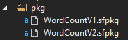
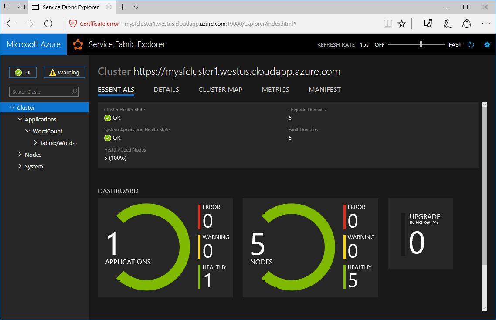

### Script: *06 - Deploy-Application.ps1*
Now we will deploy an application to our cluster.  The script will deploy the WordCount application to the cluster.  You can easily change this to deploy the application in the solution, but for examples of demonstrating an upgrade there were two versions of the WordCount app packaged.

The packages for the WordCount app are in the pkg folder.



These are zip files renamed to .sfpkg.  As an exercise, open one up and take a look.

There are three variables in the script that you may need to modify.
```
# Replace with the thumbprint of your certificate.  This is for mysfcluster1.pfx
$certificateThumbprint = "812508463AE35AF784956315D3414DF1854CF8A6"

# A prepackaged app
# Or you can use the solution app if you zip the pkg SFTF/pkg/Debug folder and change the extension to .sfpkg
# WordCount app has two versions so you can play with versioning (WordCountV1.sfpkg and WordCountV2.sfpkg)
$packageFile = "$PSScriptRoot/pkg/WordCountV1.sfpkg"
$applicationName = "fabric:/WordCount"
```

Since this is a secure cluster (wrt client applications), we must specify the thumprint of the certificate to use to connect.  The next two variables specify the package and application name.  The script connects as was done in *05 - Validate-SecureServiceFabricCluster.ps1*.

The deployment is then performed with the following statement:
```
Publish-NewServiceFabricApplication -ApplicationPackagePath $packageFile -ApplicationName $applicationName
```

This will create output similar to the following:
```
Environment           : AzureCloud
Account               : miheydt@microsoft.com
TenantId              : 72f988bf-86f1-41af-91ab-2d7cd011db47
SubscriptionId        : b02264bc-1ea4-4849-abb9-60b5293ed558
SubscriptionName      : Visual Studio Enterprise
CurrentStorageAccount : 

True
[WARNING] Cluster connection with the same name already existed, the old connection will be deleted

FabricClientSettings         : {
                               ClientFriendlyName                   : 
                               PowerShell-ae03b740-4972-4689-828f-cb6adfb55312
                               PartitionLocationCacheLimit          : 100000
                               PartitionLocationCacheBucketCount    : 1024
                               ServiceChangePollInterval            : 00:02:00
                               ConnectionInitializationTimeout      : 00:00:02
                               KeepAliveInterval                    : 00:00:10
                               ConnectionIdleTimeout                : 00:00:00
                               HealthOperationTimeout               : 00:02:00
                               HealthReportSendInterval             : 00:00:00
                               HealthReportRetrySendInterval        : 00:00:30
                               NotificationGatewayConnectionTimeout : 00:00:30
                               NotificationCacheUpdateTimeout       : 00:00:30
                               AuthTokenBufferSize                  : 4096
                               }
GatewayInformation           : {
                               NodeAddress                          : 
                               10.0.0.5:19000
                               NodeId                               : 
                               6eeb85694130458cf66877a8eda919cf
                               NodeInstanceId                       : 
                               131322729730429076
                               NodeName                             : 
                               _NodeType1_1
                               }
FabricClient                 : System.Fabric.FabricClient
ConnectionEndpoint           : {mysfcluster1.westus.cloudapp.azure.com:19000}
SecurityCredentials          : System.Fabric.X509Credentials
AzureActiveDirectoryMetadata : 

Copying application to image store...
Copy application package succeeded
Registering application type...
Register application type succeeded
Removing application package from image store...
Remove application package succeeded
Creating application...

ApplicationParameters  : {}
ApplicationName        : fabric:/WordCount
ApplicationTypeName    : WordCount
ApplicationTypeVersion : 1.0.0
MaximumNodes           : 0
MinimumNodes           : 0
Metrics                : {}

Create application succeeded.
```
Checking the service fabric explorer UI, you will see that that application is deployed.

