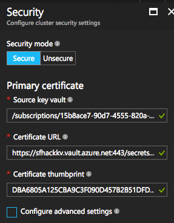

### Script: *07 - Configure-AADForAuth*

*This script assumes you have permissions to modify your active directory.  If not, it will fail quickly...  It is mostly intended for purposes of demonstration of code you would use to perform these tasks.*

This script will configure AAD to authorize access to your service fabric cluster.  This script makes use of the GraphAPI framework for ADAL.  It really is the most effective means of doing this.  I tried removing it for pure PowerShell.

The script begins with three variables your need to define / change values:
```
# name of your service fabric cluster - change as needed
$clusterName = "mikeheydtsf"

# names for the two applications that will be created in AAD - change as needed
$webApplicationName = "ServiceFabricCluster Explorer UI"
$nativeClientApplicationName = "ServiceFabricCluster Native App"
```

When you run this script, you will be presented with a sign-in form from AAD.  The script is asking you to authenticate with an account that has permissions to modify the AAD contents.  Sign in as an appropriate user.


Upon this script completing successfully, you should see output similar to the following (the GUID's will differ for you):
```
Web application created:  bc592be6-7de7-4c6c-81c5-47ec7191cca9
Web application roles:  @{allowedMemberTypes=System.Object[]; description=ReadOnly roles have limited query access; displayName=ReadOnly; id=9f183526-10c1-4518-bfa6-0dfdf3c5511d; isEnabled=True; value=User} @{allowedMemberTypes=System.Object[]; description=Admins can manage roles and perform all task actions; displayName=Admin; id=893464db-cf27-45e3-87de-04a3e3492be9; isEnabled=True; value=Admin}
Native application created:  8c406500-354f-4fbb-b517-95f878c26c75
```
The applications and associated service principals have been created in AAD.  If you go over to your AAD in the portal and examine your app registrations, you will see the following:


At this point, you need to create a service fabric cluster.  I think it best for a first time doing AAD config to walk through the portal.  When in the Security blade, still configure a primary certificate.  This will be used for HTTPS communication to the cluster.  You have done this before.



But also check the Configure Advanced Settings button, and scroll down to the **Azure Active Directory (optional)** section and enter the data output from the script (your GUID's will differ from this picture):


You are not quite set yet.  You must create a couple of AAD users, and you have to do this in the classic portal (manage.windowsazure.com).

*I am working on script to do this automatically - stay tuned!*

Go into you active directory that your are using for your cluster, and add two users.  My domain for this example is *sfhackathon.onmicrosoft.com* and has an organization name of *SF Hackaton Org*, and click on the users tab.  You should se something similar to the following:


My domain has a single user at this point (myself).  Now add a new user to the domain, call one *cluster_admin* and the other *cluster_reader*. When complete you should see the two users:


Now head over the the application registrations in the portal (using the *applications* tab). Select *Applications my company owns" and exectue the search.  You should see the two apps we added with the script.


We want to give our users access to the *ServiceFabricCluster Explorer UI* app.  Click on that app, and when that opens select the *users* tab.  You should see something similar to the following:


This shows our domain users, and that the two we created are not "Assigned" to the app.  So, select *Cluster Admin*, and then press the *Assign* button at the bottom.


A dialog box will pop up asking you to select a *role*. You will be presented with two options: *Admin* and *ReadOnly*.  These are the two roles we assigned to the app within the script.  For this user, select *Admin*.  To the "Cluster Reader", also assign them, but select *ReadOnly*


When both are assigned you should see that fact in the portal.


Now when you try to open your Service Explorer UI you will be kicked back to Azure AD to enter one of the two accounts that you created, and then the cluster will pick up the appropriate role from the configuration as it is passed to the app from AAD via OAuth.