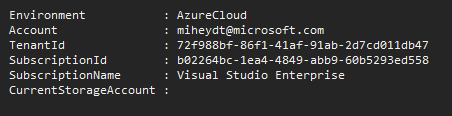

[01 - Create-SelfSignedCert.ps1](markdown/01.md)

***
#### 2/21/2017 Update: ####
The SFTF.PS project now has 6 main scripts, each named after a specific task.
Certificates are now generated by a stand alone script **01 - Create-SelfSignedCert.ps1**.  They are generated into the **certs** folder of that solution.

The **03 - Add-KeyToKeyVault.ps1** script then has a variable you can modify to specify which cert file you want to use, instead of creating one on the fly.

If you have a Windows 7 system, and therefore the certificate generation script will generate an error, you can simply use one of the predefined certificates in the certs folder.

